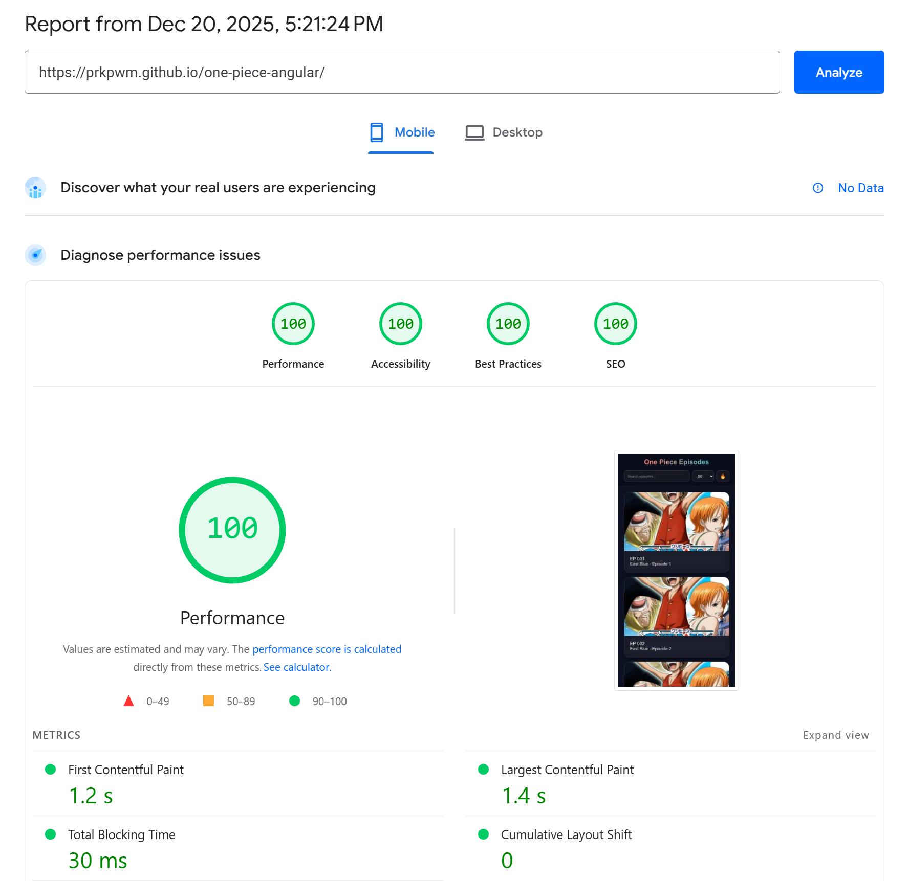

# One Piece Episode Viewer

A Netflix-style Angular application for browsing and watching One Piece episodes.

🌐 **Live Demo**: https://prkpwm.github.io/one-piece-angular/

## Features

- 📺 Episodes 001-1000 with Netflix-like grid layout
- 🔍 Search functionality
- 🎬 Embedded video player using trueid.net pattern
- 📱 Responsive design
- 🎨 Dark theme UI

## Setup

1. Install dependencies:
```bash
npm install
```

2. Start development server:
```bash
npm run dev
```

3. Open http://localhost:4200

## Usage

- Browse episodes in the grid view
- Use search to find specific episodes
- Click any episode to watch in embedded player
- Click outside video modal to close

## Episode URLs

Episodes use the pattern: `site:trueid.net "One Piece" "EP {number}" (embed OR "EP {number}")`